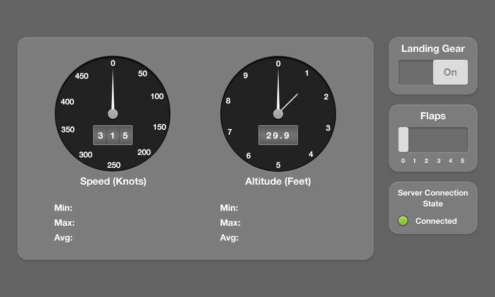

# telemetry-challenge



Full specs are [here](specs/specs.pdf).


Uses React/Redux, simply because I'm most familiar with it. If I had to do it again I might try and use RxJs and see if that makes the connection between the ws-connection and the display parts a bit cleaner, but for now I think this is fine.

---

### How to run:

```commandline
> (npm|yarn) install

> (npm|yarn) start
```
Then open `http://localhost:3000/` in the browser.

### How to build:

```commandline
> (npm|yarn) install

> (npm|yarn) build
```

### Assumptions I made

- Data sanitization: 

  I didn't know _exactly_ what counts as valid or invalid data, so, as proof of concept, I added a [sanitization module](src/js/backend-services/data-sanitization.js) that just filters out data that isn't parseable or where the airspeed or altitude seem weird to me. I'm no expert on planes though, so that definitely needs more work to check for control-messages etc.
  
- Control messages:

  For now, when toggling the landing gear or flaps ( you can drag them! 😎 ), it sets their state on the dashboard and makes a post to the backend about it. There's no round-trip to check if the control message was accepted. If the backend disagrees, it just sends the correct state with the next update.
  
- Average airspeed and altitude:

  I didn't want to keep *all* the records around until the page runs out of memory, so
  I've created a rudimentary buffer that maintains a rolling average over a certain amount of time. This could potentially be used to get the data for the line-graph mentioned in the specs!
  
- Browser support:

  The needle gauges' css uses plain `transform: xyz;` which might not work in older browsers.
  

### What I'm happy with

- Code-structure:

  I think the display and logic parts are reasonably well separated. The Store is only responsible for display-data, all else is done by the [connection-interface](src/js/backend-services/connection-interface.js).
  
- Self-documenting code:
  
  Some things could be better named, but I think the code is pretty self-explanatory, that's why there isn't a lot of documentation. The Redux stuff follows almost exactly Dan Abramov's naming/architecture conventions, so that can be used as reference.
  
- Features:

  I've added the option to disconnect by clicking on the Server Connection State. 
  

### What I would like to improve:
  

- Write tests:
  
  Especially the [buffer](src/js/backend-services/buffer.js) and [sanitization](src/js/backend-services/data-sanitization.js) modules need some unit tests.

- Clean up the (s)css:

  For now it's all squished into one file and not very well ordered. I would extract variables like colors, fonts etc into a separate file so a designer can tweak them without needing me.
  
  Especially the exact pixel-positions of the screen elements should live somewhere central in case they change in the future.
  
  Also the fonts and font-sizes aren't great but this needs quite a bit of fiddling.
